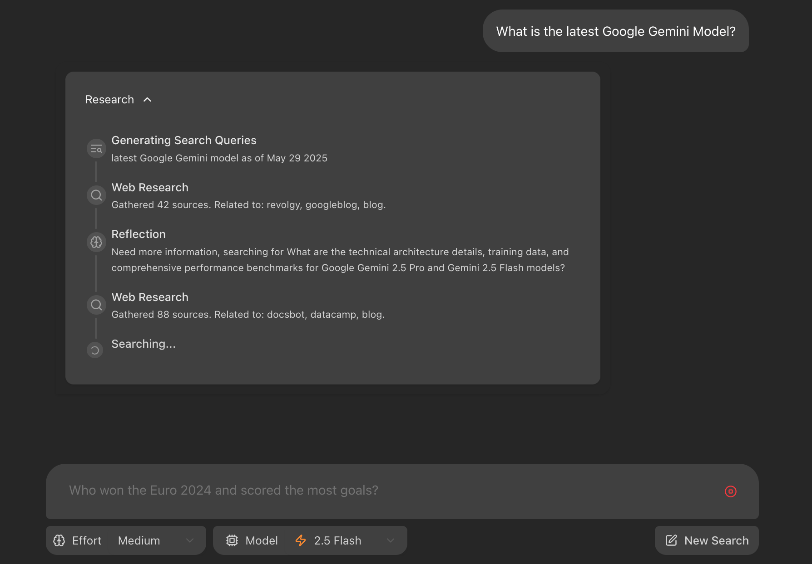

# GemGraph

**GemGraph** is a research-driven AI synthesis tool combining a FastAPI backend and a Vite/React frontend. It enables agentic workflows over web and local documents, designed for experimentation with LLMs, semantic analysis, and modular pipeline orchestration.

---

## 🚀 Features

- ⚡ FastAPI REST API with auto-generated documentation  
- 🎛️ Modular agent and graph reasoning pipeline  
- 🌐 Vite + React + TypeScript frontend  
- 📎 Web and document ingestion workflows  
- 🧠 Supports LLM-driven synthesis  

---

## 🧰 Prerequisites

- macOS 12+ (tested on macOS Tahoe26)  
- Python 3.11+  
- Node.js 18+  
- `make`, `pip`, and optionally `pipx`  

---

## 🏗️ Setup

```bash
git clone https://github.com/strnglybrwn/gemgraph.git
cd gemgraph
make install         # creates virtualenv and installs backend deps
make start           # starts FastAPI backend
make stop            # stops all services cleanly and frees ports
```
- Access API docs: [http://localhost:8000/docs](http://localhost:8000/docs)  
- Access app UI: [http://localhost:5173](http://localhost:5173)  

---

## ⚙️ Architecture

```
[React UI (Vite)] ← HTTP → [FastAPI REST API] ← LLMs, Graph Workflows, Ingestors
```

- **Backend**: `/backend`  
  - Ingestion, agent orchestration, APIs  
- **Frontend**: `/frontend`  
  - Query interface, result visualization  

---

## 🧪 Development Workflow

- Add new services under `backend/services/`  
- Register endpoints in `backend/apis/`  
- Wire up frontend calls in `frontend/src/`  
- Run tests:

```bash
cd backend && pytest
cd frontend && npm test
```

---

## 🛠️ Troubleshooting

| Problem                          | Fix                                           |
|----------------------------------|-----------------------------------------------|
| `make install` fails             | Use Python 3.11+, check `pip`, `venv`         |
| 5173 UI not loading              | Ensure backend is up and CORS is allowed      |
| `thread.append` error in UI      | Validate response JSON format from backend    |

---

## 📦 Deployment

- Designed for LAN deployment via local homelab or server  
- Use static IP or Bonjour address (e.g. `http://server.local:5173`)  
- Update `vite.config.ts` → `server.allowedHosts` to include local hostname  
- Optionally configure nginx or Caddy as reverse proxy  

---

## 📸 Diagrams




---

## 🤝 Contributing

1. Fork the repo & branch from `main`  
2. Submit PR with clear description  
3. Style guide: Black (Python), Prettier (JS/TS)  
4. License: Apache 2.0  

---

## 📄 License

Licensed under the [Apache-2.0 License](LICENSE).
